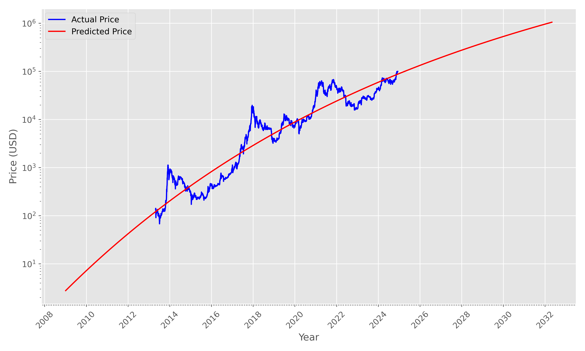

# The Bitcoin Gompertz Model

This model combines the [Gompertz function](https://en.wikipedia.org/wiki/Gompertz_function) & growth function to predict Bitcoin's price. As adoption grows, the price increase slows down.

## Assumptions
The Bitcoin Gompertz model assumes that the Bitcoin price is influenced by at least three factors:
1. Inflation of the denominator (USD)
2. Increasing productivity
3. The adoption curve
   
Factors (1) and (2) can be collectively estimated by the growth of global wealth in USD between 2009 and the present, which is approximately 5.8%.
In addition to this, the adoption curve is modeled using the Gompertz function.

**Bitcoin Price = Global Wealth Increase * Adoption Curve**

The 5.8% annualized gains are quickly modeled with an exponential function.
The [Gompertz function](https://en.wikipedia.org/wiki/Gompertz_function), in addition to the parameters b and c, which we can estimate from historical prices, also requires an upper growth limit.
I have defined this limit as the global wealth in 2009 divided by 21 million (["Everything divided by 21 million"](https://www.amazon.com/Bitcoin-Everything-divided-21-million/dp/9916697191)). 
In the Bitcoin Gompertz model, the Increase in global wealth models this upper limit as a function of time.

## Getting Started
1. Clone this repository to your local machine using `git clone https://github.com/Jafar874/BTC_Gompertz/`.
2. Run the example app with `python3 main.py` or use as a library check out the [examples](./examples).

## Update Price Model
Historic prize data was gathered from [Coingecko](https://www.coingecko.com/en/coins/bitcoin).
If you wish to update the model, download the prize data as .csv into the [data](./data) folder.
Then run the [`get_cp.py`](./get_cp.py) script.
The Gompertz parameters b and c can either be stored in memory or written to [`__init__.py`](./__init__.py) as global variables.

## Limitations
Note that the model assumes perfect information among all market participants. However, in practice this is not the case.
Although halving events are 100% programmatic in Bitcoin, the supply shock afterwards has historically resulted in abrupt price increases.
This can be explained by the information assymmetry between HODLers and naive market participants.
In turn, the relative deviation from the predicted price during these halving cycles has observed to become smaller with increasing adoption.
Future work could extend the model to include boom/bust cycles as a function of bitcoin [adoption](./examples/adoption.ipynb).
